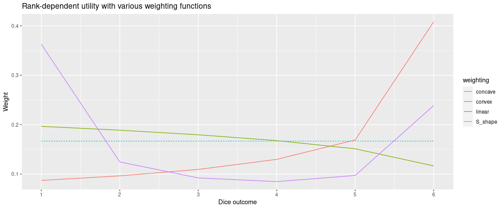
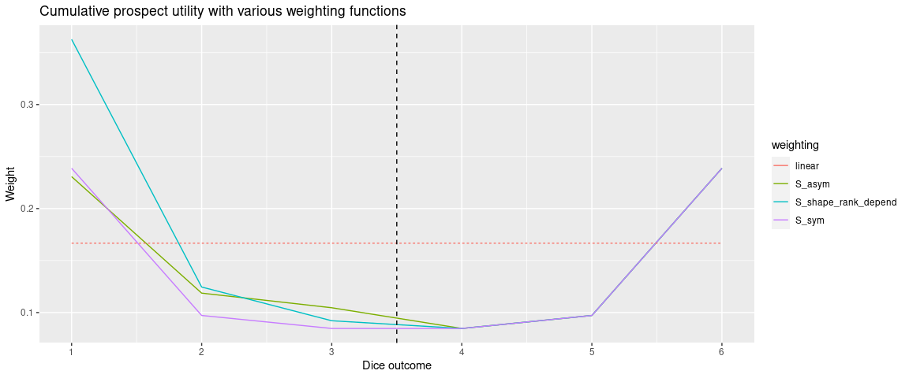

# Goal

I am just trying to understand the intuition behind the cumulative prospect theory: what does it mean to: 

1. Use rank-dependent utility
2. Use different weights for gain/losses and a different formulation of the probabilities? 

Case study: fair dice with equi-probability 1/6. Values 1 to 3 lead to a loss, values 4:6 to a gain. This is as in Tversky-Kahneman (1993), although for now I don't consider differences the outcomes they attribute to 1 to 6.

## Rank dependent utility


```r
weight_S <- function(p, gam=0.61) p^gam /(p^gam +(1-p)^gam)^(1/gam)
df_rank_depend <- tibble(outcome=1:6,
       prob = 1/6,
       prob_cum = rev(cumsum(prob)),
       prob_cum_lead = dplyr::lead(prob_cum, default=0),
       dec_convex= prob_cum^1.2-prob_cum_lead^1.2,
       dec_concave= prob_cum^0.5-prob_cum_lead^0.5,
       dec_linear= prob_cum-prob_cum_lead,
       dec_S_shape=weight_S(prob_cum)-weight_S(prob_cum_lead))

df_rank_depend%>% 
  pivot_longer(starts_with("dec_"), names_prefix="dec_", names_to="weighting")  %>% 
  mutate(type=weighting=="linear") %>% 
  ggplot(aes(x=outcome, y=value, color=weighting))+
  geom_line(aes(linetype=type))+
  scale_x_continuous(breaks=1:6)+
  xlab("Dice outcome")+ylab("Weight")+
   scale_linetype(guide = 'none')
```

<!-- -->

## Prospect theory


```r
weight_S_minus <- function(p, gam=0.69) p^gam /(p^gam +(1-p)^gam)^(1/gam)

tibble(outcome=1:6,
       gain=c(-5, -3, -1, 2, 4, 6),
       prob = 1/6,
       prob_cum = if_else(gain<0, cumsum(prob), rev(cumsum(prob))),
       prob_cum_lag = if_else(gain<0,
                              dplyr::lag(prob_cum, default=0),
                              dplyr::lead(prob_cum, default=0)),
       dec_linear = prob_cum-prob_cum_lag,
       dec_S_sym = weight_S(prob_cum)-weight_S(prob_cum_lag),
       dec_S_asym =  if_else(gain<0,
                             weight_S_minus(prob_cum)-weight_S_minus(prob_cum_lag),
                             weight_S(prob_cum)-weight_S(prob_cum_lag))) %>% 
  mutate(dec_S_shape_rank_depend=df_rank_depend$dec_S_shape) %>% 
  pivot_longer(starts_with("dec_"), names_prefix="dec_", names_to="weighting")  %>% 
  mutate(type=weighting=="linear") %>% 
  ggplot(aes(x=outcome, y=value, color=weighting))+
  geom_line(aes(linetype=type))+
  scale_x_continuous(breaks=1:6)+
  xlab("Dice outcome")+ylab("Weight")+
   scale_linetype(guide = 'none')+
  geom_vline(xintercept = 3.5, linetype=2)
```

<!-- -->


