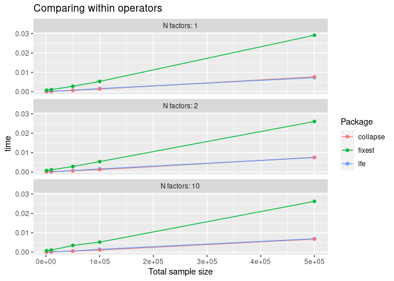
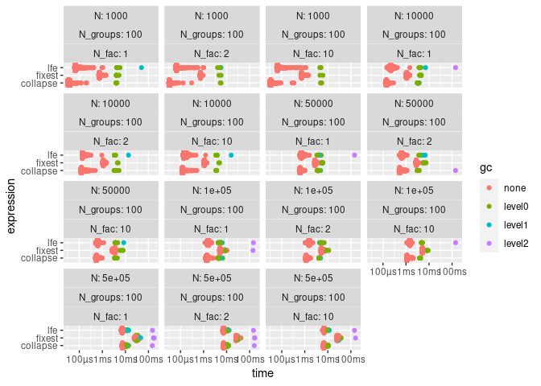

# Goal

The goal here is to compare three ways to obtain the "within" transformation which is used to run fixed-effects models:

- `lfe::demeanlist`
- `collapse::fwithin` (and `collapse::fhdwithin`)
- `fixest::demean`

# Preliminary conclusion

For large datasets, `collapse` seems the best tool, since it is faster and actively maintained (as of Nov 2021), contrary to `lfe` which is no more developed and improved. 

# Code and results


```r
library(lfe)
library(collapse)
library(fixest)

## used for benchmarking and plotting:
library(bench)
library(tidyverse)
```

### Warm up: single use


```r
mtx <- data.frame(matrix(rnorm(999),ncol=3))
rgb <- c('red','green','blue')
fl <- factor(sample(rgb,nrow(mtx),replace=TRUE))
fll <- list(f1=fl, f2=factor(sample(rgb,nrow(mtx),replace=TRUE)))

mtx0 <- demeanlist(mtx,list(fl))
mtx1 <- fwithin(mtx, fl)
mtx2 <- fixest::demean(mtx, fl)
```

Compare results:


```r
all.equal(mtx0, mtx1)
```

```
## [1] TRUE
```

```r
all.equal(mtx0, mtx2)
```

```
## [1] TRUE
```


## Now benchmark


```r
create_df <- function(N=10000, N_groups=20, N_vars=3, N_fac=1) {
  mtx <- data.frame(matrix(rnorm(N*N_vars),ncol=N_vars))
  fl <- replicate(N_fac,
                  factor(sample(as.character(1:N_groups), nrow(mtx), replace=TRUE)),
                  simplify=FALSE)
  list(data=mtx, factor=fl)
}

# create_df()

results <- bench::press(
  N = c(1000, 10000, 50000, 100000, 500000),
  N_groups = 100,
  N_fac=c(1,2,10),
  {
    dat <- create_df(N, N_groups)
    bench::mark(
      min_iterations = 100,
      lfe = lfe::demeanlist(dat$data,dat$factor),
      collapse= collapse::fwithin(dat$data, dat$factor),
      fixest = fixest::demean(dat$data, dat$factor)    )
  }
)
```

### Show results


```r
# head(results)
```

Plot:


```r
results %>% 
  mutate(time = as.numeric(median), 
         Package= attributes(expression)$description,
         N_fac_char = paste("N factors:", N_fac) %>% 
           fct_reorder(N_fac)) %>% 
  # filter(N_groups==2) %>% 
  ggplot(aes(x=N, y=time, color=Package))+
  geom_line()+
  geom_point() +
  facet_wrap(~N_fac_char, ncol=1)+
  ggtitle("Comparing within operators")+
  xlab("Total sample size")
```

<!-- -->

Could alternatively plot with: 


```r
ggplot2::autoplot(results)
```

<!-- -->

